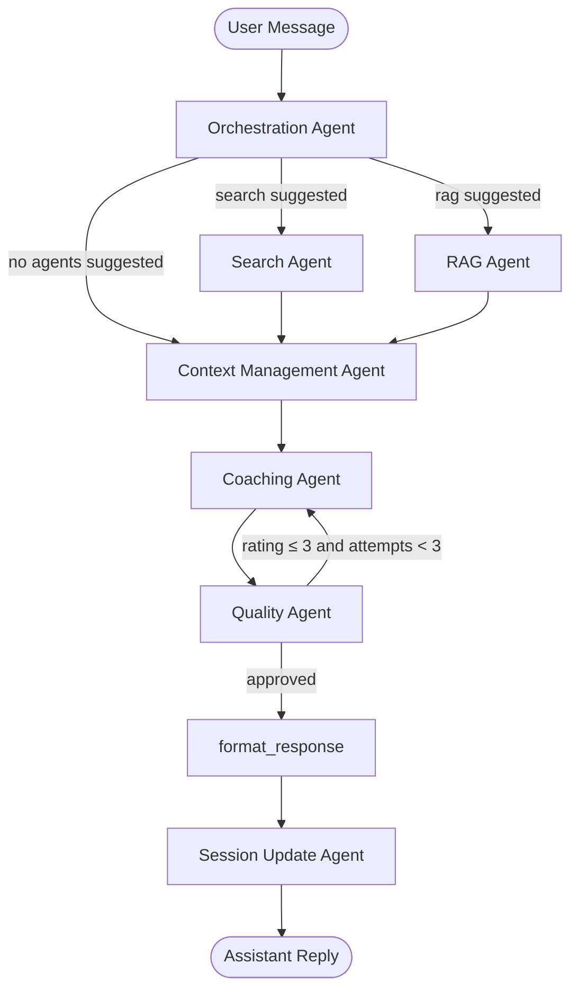
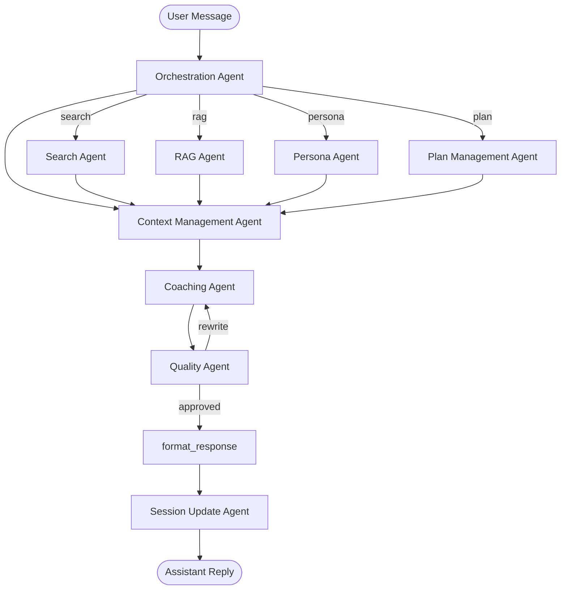

# Agent Interactions

This document describes the agent topology for the Mentat pipeline, including
current implementation and planned future agents.

---

## Current Pipeline

Search and RAG are dispatched in **parallel** when both are suggested — LangGraph
fan-out merges their results before `context_management` runs.

The Quality Agent may loop the Coaching Agent up to 3 times before forcing
`format_response` regardless of score.

### Node Descriptions

| Node | Agent | Purpose |
|------|-------|---------|
| `orchestration` | `OrchestrationAgent` | Classifies user intent; decides which agents to invoke |
| `search` | `SearchAgent` | Generates queries, fetches DuckDuckGo results, summarizes |
| `rag` | `RAGAgent` | Embeds query → ANN search over Neo4j (Chunks + Memories) → graph expand → LLM synthesis |
| `context_management` | `ContextManagementAgent` | Ranks context, identifies session phase, produces coaching brief |
| `coaching` | `CoachingAgent` | Constructs the actual coaching response using the brief |
| `quality` | `QualityAgent` | Rates response 1–5 on five dimensions; triggers rewrite if score ≤ 3 |
| `format_response` | `format_response` / `OutputTestingAgent` | Renders `coaching_response` as the assistant reply (falls back to `coaching_brief` then orchestration summary) |
| `session_update` | `SessionUpdateAgent` | Persists session state (conversation type, phase, scratchpad, collected data) |

### Background Services

| Service | Purpose |
|---------|---------|
| `IngestAgent` | Chunks and embeds conversation turns and uploaded documents into Neo4j after each chat turn |
| `ConsolidationAgent` | Runs every 30 minutes; synthesizes Memory nodes, builds entity co-occurrence edges, writes Insight nodes |

---

## Planned Future Agents

The following agents are designed but not yet implemented:

### Planned Node Descriptions

| Node | Agent | Purpose |
|------|-------|---------|
| `persona` | `PersonaAgent` | Maintains understanding of the user (goals, challenges, personality) |
| `plan` | `PlanManagementAgent` | Tracks long-term coaching plan and progress towards goals |

### Post-Session Agents (run after conversation ends)

| Agent | Purpose |
|-------|---------|
| `PersonaAgent` (update) | Updates user profile with new goals or insights from the session |
| `PlanManagementAgent` (update) | Updates coaching plan with progress and new action items |
| `ClientManagementAgent` | Summarizes the session; logs action items and plan changes |
