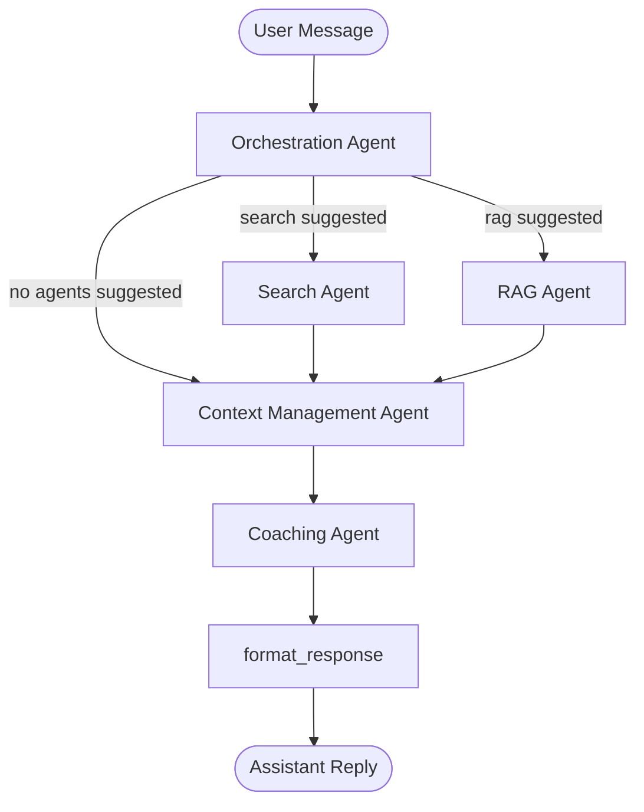
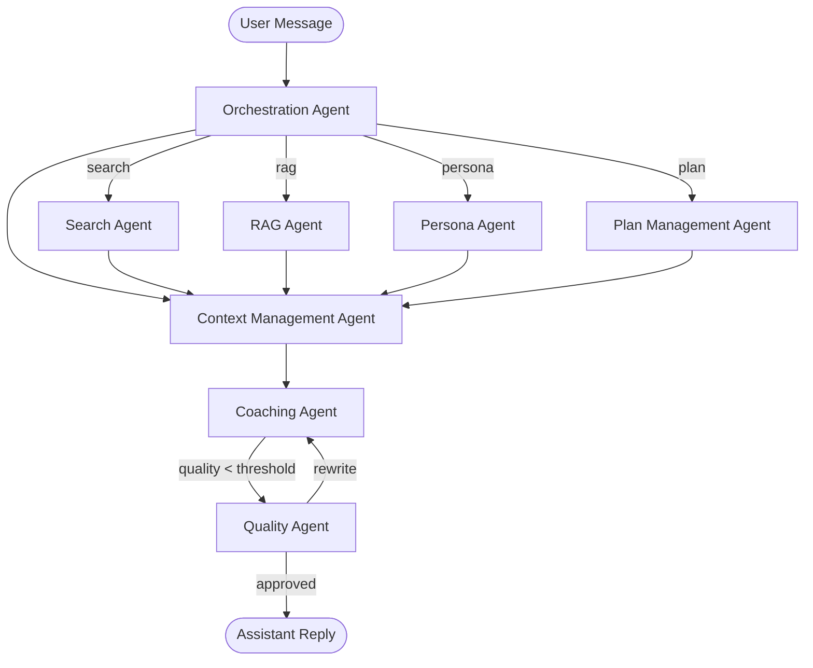

# Agent Interactions

This document describes the agent topology for the Mentat pipeline, including
current implementation and planned future agents.

---

## Current Pipeline (Phase 4+)

Search and RAG are dispatched in **parallel** when both are suggested — LangGraph
fan-out merges their results before `context_management` runs.

### Node Descriptions

| Node | Agent | Purpose |
|------|-------|---------|
| `orchestration` | `OrchestrationAgent` | Classifies user intent; decides which agents to invoke |
| `search` | `SearchAgent` | Generates queries, fetches DuckDuckGo results, summarizes |
| `rag` | `RAGAgent` | Retrieves relevant chunks from ChromaDB; summarizes |
| `context_management` | `ContextManagementAgent` | Ranks context, identifies session phase, produces coaching brief |
| `coaching` | `CoachingAgent` | Constructs the actual coaching response using the brief |
| `format_response` | `format_response` / `OutputTestingAgent` | Renders `coaching_response` as the assistant reply (falls back to `coaching_brief` then orchestration summary) |

---

## Planned Future Agents

The following agents are designed but not yet implemented:

### Planned Node Descriptions

| Node | Agent | Purpose |
|------|-------|---------|
| `persona` | `PersonaAgent` | Maintains understanding of the user (goals, challenges, personality) |
| `plan` | `PlanManagementAgent` | Tracks long-term coaching plan and progress towards goals |
| `quality` | `QualityAgent` | Rates the response (1–5); triggers a rewrite if score ≤ 3 |

### Post-Session Agents (run after conversation ends)

| Agent | Purpose |
|-------|---------|
| `PersonaAgent` (update) | Updates user profile with new goals or insights from the session |
| `PlanManagementAgent` (update) | Updates coaching plan with progress and new action items |
| `ClientManagementAgent` | Summarizes the session; logs action items and plan changes |
